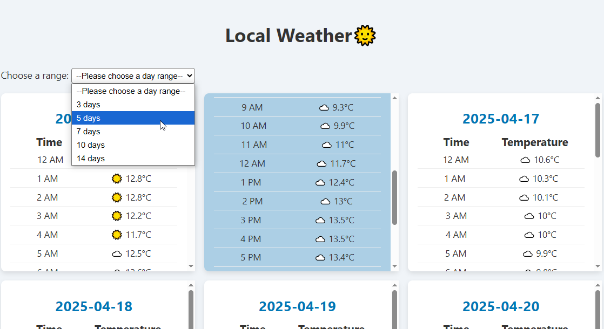

# Your project name

# ☀️ Weather Forecast

> A weather forecast application that displays hourly and daily weather data in a user-friendly interface. Built with **HTML**, **CSS**, and **JavaScript**.

---

## 📑 Table of Contents

- [General Info](#general-info)
- [Screenshots](#screenshots)
- [Technologies](#technologies)
- [Setup](#setup)
- [Code Examples](#code-examples)
- [Features](#features)
- [To-Do List](#to-do-list)
- [Project Status](#project-status)
- [Contact](#contact)

---

## General Info

**Weather Forecast** is a web-based application that fetches and displays weather data (hourly and daily) from an API. It presents the data in a visually structured layout with dynamic DOM rendering and scroll-based background color changes that reflect different times of the day.

---

## Screenshots



---

## Technologies

- HTML5
- CSS3
- JavaScript (Vanilla)
- OpenWeather API
- Visual Studio Code (IDE)

---

## Setup

1. Clone this repository:

   ```sh
   git clone https://github.com/yourusername/weather-forecast.git
   ```

2. Navigate to the project folder:

   ```sh
   cd weather-forecast
   ```

3. Open `index.html` in your browser.

---

## Code Examples

```js
const renderWeather = (dailyWeather) => {
  dom.container.innerHTML = '';

  for (const [day, hourlyWeather] of Object.entries(dailyWeather)) {
    const weatherDom = createWeatherDom(day, hourlyWeather);
    dom.container.append(weatherDom);
  }
};
```

## Features

- Display weather data grouped by day and hour

- Scroll to reveal different parts of the day with dynamic color backgrounds

- Select date range to re-fetch and update the forecast dynamically

- Optimized layout for readability and interaction

## To Do

- Use user's location to fetch weather data

- Improve UI/UX design for different screen sizes

- Add temperature units toggle (°C / °F)

## Project Status

Project is: Base project completed

## Contact

By [boba-milktea](https://github.com/boba-milktea)
